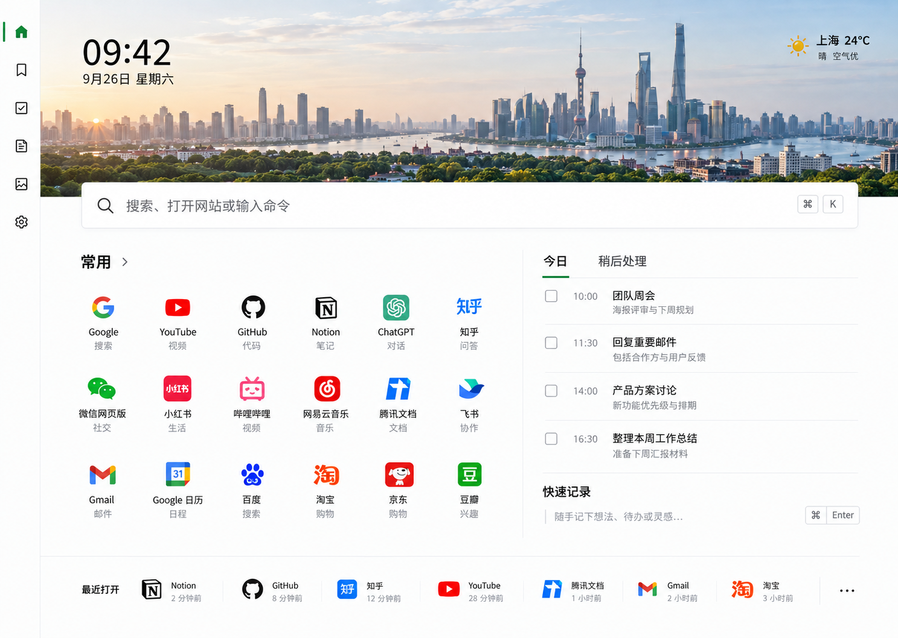

# 个人新标签页第一版设计规格

- 日期：2026-09-26
- 状态：用户于 2026-09-26 审阅并确认；2026-09-27 已实现网页与扩展构建，实际验证及剩余限制见 `docs/verification.md`。
- 工作方式：Superpowers 负责需求与工程规划，Product Design 负责视觉设计与对照验收；关键界面使用文字与图片共同确认。

## 1. 已确认的方向

为用户自己制作一个日常使用的浏览器新标签页，打开后可以搜索、进入常用网站、查看待办并记录想法。

用户已确认：

- 使用第三张设计图作为主视觉参考。
- 做可安装的 Chrome/Edge Manifest V3 扩展，同时提供普通网页开发预览。
- 技术栈选择 React + TypeScript + 原生 Vite，自行维护扩展清单与打包配置。
- 样式使用 CSS Modules + CSS Variables。
- 第一版纯本地、无需登录，使用 `chrome.storage.local` 保存用户数据。
- 第一版包含搜索、壁纸、快捷网站、可拖拽组件、时间日期、天气、待办和便签。

以下交互和范围已随本文件整体审阅通过；后续偏离范围的改动需要说明。

## 2. 视觉基准

参考图来自本次 Product Design 视觉探索。图中的上海、时间、天气、任务与网站均为示例，不代表用户真实位置或数据，也不代表需要逐项增加对应功能。

保持以下结构：左侧窄导航栏、顶部横幅壁纸与时间天气、横贯主区的搜索框、中部左侧快捷网站与右侧待办/便签、底部最近打开。

- 主背景为白色，正文接近黑色，分隔线为浅灰，绿色标识选中和完成状态；站点图标保留自身色彩。
- 以间距、对齐和细分隔线组织内容，待办行不做独立卡片。
- 基础文字 14–16px，模块标题约 18–20px，时间约 56px。字距为 0，不按视口宽度缩放字号。
- 导航栏约 60–64px；主内容桌面左右留白约 48–64px；主体两栏约 58:42。
- 1440×1024 是主要验收尺寸；在 1366×768 下压缩横幅高度和间距，保证搜索与主要内容可见。
- 1024px 以下改为单栏，窄屏导航改为紧凑图标栏；320px 宽度下不出现页面横向溢出。
- 圆角不超过 8px；图标按钮有可访问名称和悬停提示；长名称换行或省略并可查看完整内容。
- 第三张图是视觉基准；额外页面和弹层沿用它的视觉语言。必要时以新的局部设计稿确认，不重新选择整体风格。

## 3. 页面与交互

### 3.1 首页与导航

左侧入口为首页、网站、待办、便签、壁纸和设置。网站、待办、便签入口打开对应的完整管理视图，壁纸和设置打开侧边面板；返回首页不丢失已保存数据。

第一版聚焦单个工作台，不增加多个桌面、账号中心、内容推荐或组件商店。

### 3.2 搜索

- 支持搜索文字、输入网址和查找已保存的快捷网站。
- 提供必应、百度、Google 选择，默认必应，保存用户选择。
- 下拉结果优先显示匹配的快捷网站，并提供网页搜索操作。
- 明确的 HTTP/HTTPS 地址直接打开；无协议的有效域名补充 HTTPS；其他输入作为搜索词并正确编码。
- 不执行 `javascript:`、`data:`、`file:` 等非网页协议。
- Enter 提交、上下键选结果、Esc 关闭结果；中文输入法确认候选时不提交。
- 默认在当前标签页打开，设置中可切换为新标签页。
- 第一版不做远程搜索建议、AI 对话或任意命令系统；将概念图输入提示中的“输入命令”调整为真实支持的搜索与网址操作。
- 不依赖打开标签页时自动聚焦页面输入框，尊重浏览器地址栏的初始焦点。

### 3.3 常用网站

- 支持添加、编辑、删除、分组、组内排序和移动分组。
- 每个网站包含名称、URL、图标和分组；新增入口使用加号图标。
- 自带少量可删除的常用网站，首次初始化一次，不在用户清空后重新填充。
- 内置网站使用随扩展打包的图标；自定义网站无图标时使用图标库中的通用网站图标，第一版不自动向第三方图标服务发送网址。
- 支持拖拽排序，也提供菜单中的移动操作，供键盘使用。

### 3.4 待办

- 首页提供“今日”和“稍后处理”两个列表，支持新增、修改、完成、删除和移动。
- 待办包含标题、可选备注、可选目标日期与时间。时间仅用于展示，不提供系统通知或后台闹钟。
- “今日”包含今天及之前到期的未完成任务；过期任务显示逾期。无日期和未来日期的任务进入“稍后处理”。
- 将任务移到今日时设置日期为今天；移到稍后时清除目标日期。用户也可以直接指定未来日期。
- 完成项折叠显示，可撤销完成。跨天时保留未完成任务，不自动删除。
- 初次安装待办为空；测试演示数据与真实用户数据分开。

### 3.5 便签

- 首页“快速记录”用于直接输入和保存一条纯文本便签；完整便签视图用于查看、编辑和删除历史便签。
- 输入草稿自动保存，提交后成为独立记录并清空草稿；重复打开页面可恢复已保存草稿。
- 不支持富文本、文件附件和 Markdown 编辑器。
- 自动保存提供保存中、已保存、失败重试状态；失败时保留当前输入，不显示虚假的成功状态。

### 3.6 拖拽布局

- 默认布局与参考图一致，只有进入“编辑布局”后才出现模块拖拽手柄。
- 搜索和顶部横幅固定；网站、待办、便签、最近打开作为可移动模块，在预设网格槽位中排序或跨列移动。
- 模块不支持任意重叠或自由像素定位；支持隐藏、恢复显示和恢复默认布局。
- 调整暂存在编辑会话中，点击完成后保存，取消则恢复进入编辑模式前的布局。
- 键盘菜单提供移动模块操作；窄屏用单列顺序呈现，不反向覆盖桌面布局。
- 采用成熟拖拽库完成核心交互；具体库与版本在实施计划中核对后确定。

### 3.7 时间、壁纸与天气

- 时间与日期来自用户系统时间，支持 12/24 小时制，默认 24 小时；切回页面时立即校准。
- 横幅默认使用与参考图接近的城市全景素材，可换为内置壁纸或本地上传图片；支持调整裁切位置。
- 图片统一使用真实或生成的位图资产。上传的 PNG/JPEG/WebP 经过尺寸压缩后再保存，压缩结果上限 1.5MB；超限或格式错误时提示并保留旧壁纸。
- 第一版只保留一张自定义壁纸，不做相册、视频壁纸和在线壁纸推荐。
- 天气默认未配置；点击设置城市后启用。使用城市搜索，不申请设备定位权限。
- 建议以 Open-Meteo 提供城市查询和当前天气，显示温度与天气状况，标明来源；不加入概念图中需要额外数据源的空气质量。
- 城市选择和缓存保存在本地；启用天气会向服务商发送城市查询或城市坐标，不发送待办、便签和站点数据。
- 成功结果缓存 30 分钟；页面打开或恢复可见时检查缓存，过期才刷新。超时显示缓存及更新时间，无缓存时显示不可用与重试入口。
- 天气接口的连通性、免费使用条件和 Chrome/Edge 权限行为要在实施阶段实际验证。

### 3.8 最近打开与设置

- 最近打开只记录用户从本新标签页主动打开的快捷网站，按 URL 去重，保留最近 20 个，首页展示一行。
- 不读取浏览器全局历史；支持清空记录和关闭记录功能。
- 设置包括搜索引擎、打开方式、12/24 小时制、天气城市、模块显示和布局恢复。
- 第一版以参考图浅色主题交付，深色模式、导入导出和跨设备同步留到后续版本。
- 所有删除操作提供确认或可撤销反馈，恢复布局不删除任务、便签和站点。

## 4. 技术结构

React 19 + TypeScript + Vite 为已确认基础，不引入 WXT。补丁版本和配套依赖需在实施时核对兼容性并通过锁文件固定。

| 单元 | 职责 |
| --- | --- |
| 应用外壳 | 导航、响应式布局、弹层、错误反馈 |
| 功能模块 | 搜索、站点、待办、便签、壁纸、天气、布局、最近打开 |
| 存储服务 | 初始化、读写、版本迁移、变更订阅、错误处理 |
| 平台适配 | 扩展运行时与普通网页预览之间的存储和权限差异 |
| 扩展打包 | 维护 Manifest V3，将新标签页指向打包后的本地 HTML |

组件通过功能 Hook 和存储服务访问数据，避免在每个组件中直接调用浏览器 API。初版使用 React 自带状态能力，暂不增加全局状态管理框架。

扩展环境使用 `chrome.storage.local`；普通网页预览使用本地存储适配器。两种环境数据彼此独立，预览不会冒充可用的扩展 API。

自带图片、字体和图标随扩展打包，初次打开不等待网络资源。扩展基础权限为 `storage`；天气只声明对应服务域名的可选访问权限，在用户启用天气时请求。

第一版不使用内容脚本，不注入用户访问的网站；没有后台定时任务时不添加常驻逻辑。仅按需核对浏览器能力和声明权限。

## 5. 数据与保存规则

主要实体：

- `Shortcut`：id、名称、URL、图标引用、分组、排序值、更新时间。
- `ShortcutGroup`：id、名称、排序值。
- `Task`：id、标题、备注、可选目标日期/时间、完成时间、排序值、更新时间。
- `Note`：id、正文、创建时间、更新时间；草稿独立保存。
- `Settings`：搜索、打开方式、时间格式、天气城市、最近打开开关、壁纸引用。
- `Layout`：模块 id、网格位置、可见性、布局版本。
- `RecentEntry`：URL、名称、图标引用、最后打开时间。
- `WeatherCache`：城市标识、天气字段、获取时间。
- `SchemaMetadata`：数据结构版本和初始化标记。

任务、站点和便签按实体独立键保存，避免保存整个应用快照时覆盖其他标签页的数据。站点和任务按实体中的排序值排列，便签按更新时间排列；模块位置单独存放在布局记录中。

初次读取完成前不写默认数据；读取失败时提供重试，不把失败当作空数据。初始化和迁移可重复执行，不能覆盖已有用户内容。

监听存储变化更新其他打开的新标签页。对同一记录同时编辑采用最后一次成功写入生效，不宣称具备协同编辑合并能力；当前有未保存输入时保留草稿并提示外部变更。

草稿自动保存延迟控制在 300ms 左右，失焦时立即尝试保存。浏览器强制关闭前尚未成功保存的最后输入不能保证恢复，UI 以真实保存状态为准。

壁纸以单独键保存，避免每次编辑文字都重写图片。接近容量限制或写入失败时保留原数据并显示具体错误；不自动清空存储。

本地存储并非备份：卸载扩展会清除其本地数据。后续版本再设计导出和同步。

## 6. 异常与验收

验收以实际行为为准：

1. Chrome 和 Edge 加载扩展后，新开普通标签页显示本产品；不承诺替换无痕新标签页。
2. 断网时仍能显示布局、自带壁纸和本地内容，进行待办与便签操作；外部搜索、网站和天气依赖网络。
3. 新增、修改、删除和排序保存后，刷新页面及重启浏览器可恢复。
4. 打开两个新标签页，修改不同任务不互相覆盖，已保存变更可同步显示。
5. 搜索正确处理中文、域名、完整网址、非法协议和中文输入法状态。
6. 布局支持编辑、保存、取消与恢复默认，站点和模块拖拽分别验证。
7. 空列表、加载中、图片损坏、天气超时/拒绝权限、存储读取和写入失败都有可理解的状态。
8. 在 1440×1024 对照所选设计图检查比例、间距、字体和素材；另检查 1366×768、1024×768、390×844 和 320px 窄屏，无文本遮挡或横向溢出。
9. 核心操作可键盘完成，弹层具有正确焦点管理，关闭后焦点返回触发按钮。
10. 执行 TypeScript 检查、生产构建、核心逻辑与组件测试，并在真实扩展环境检查资源路径、权限和内容安全策略。

测试工具建议使用 Vitest、React Testing Library 和 Playwright。网页预览通过与扩展安装通过分别记录，无法完成的浏览器验证明确标注。

## 7. 交付及后续顺序

当前交付为本设计规格与已选视觉参考。审阅本文件后编写实施计划，再按计划开发、视觉对照和扩展验证。

最终交付包含源码、锁文件、可加载的扩展目录、本地预览方式、中文运行与安装说明，以及实际执行的验证结果。

第一版不包含账号、云同步、后端服务、AI、在线组件商店、系统提醒、完整浏览历史读取或商店发布。发布与云服务需要后续单独规划。

## 8. 官方资料

- [Chrome Storage API：本地保存、变更事件及容量限制](https://developer.chrome.com/docs/extensions/reference/api/storage)
- [Chrome 新标签页替换：清单配置、初始焦点及无痕限制](https://developer.chrome.com/docs/extensions/develop/ui/override-chrome-pages)
- [Open-Meteo 天气文档](https://open-meteo.com/en/docs)
- [Open-Meteo 使用条款](https://open-meteo.com/en/terms)
- [Vite 入门与 React TypeScript 模板](https://vite.dev/guide/)

## 9. 草案自检

- 已保留最初确认的可拖拽组件、时间天气、搜索、壁纸、站点、待办与便签。
- 已区分用户确认项和本次建议，没有把概念图演示数据当成用户数据。
- 已区分纯本地数据保存与天气联网，避免把无需服务器理解成所有功能离线可用。
- 已限定第一版范围，描述保存失败、跨标签页编辑和数据生命周期。
- 本节保留设计时的范围自检；实现与安装验收状态以 `docs/verification.md` 为准。
